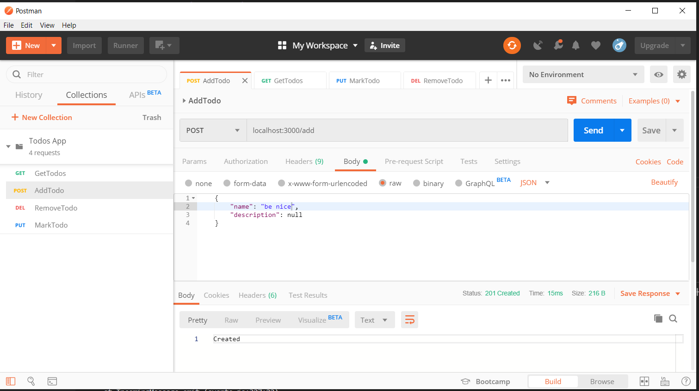
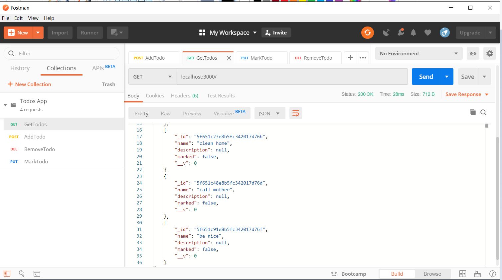
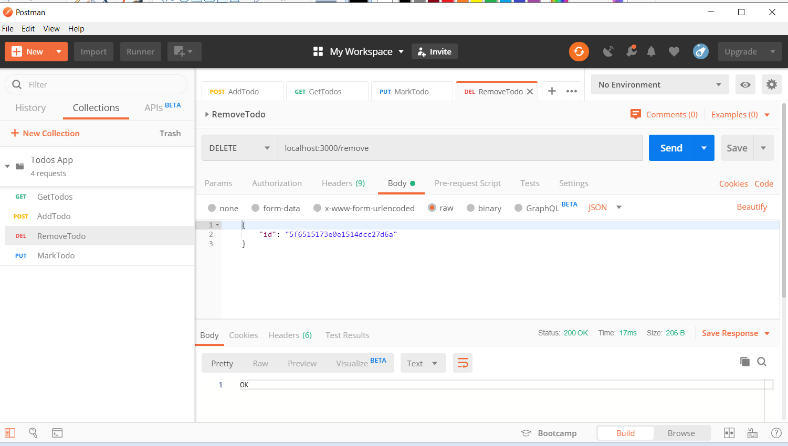
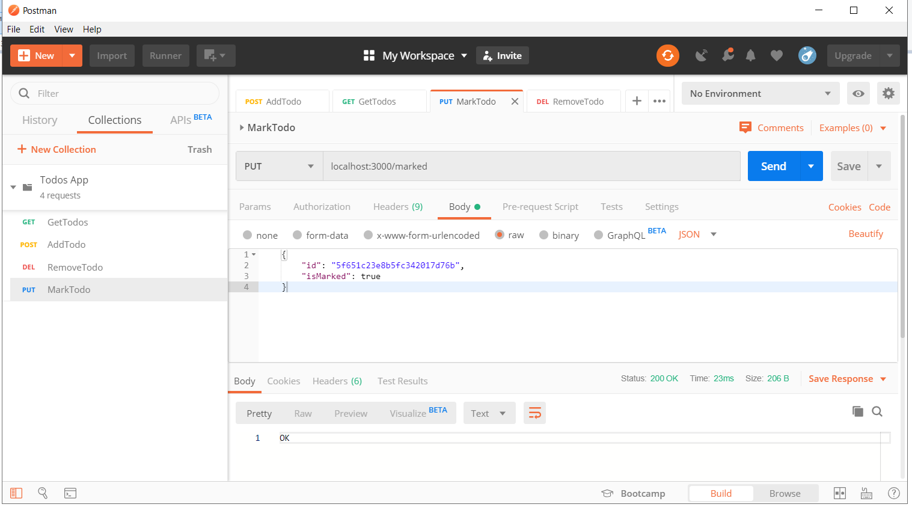

# TodoApp 

Test task for Techmagic 
using node.js, express, mongoose and Joi.

## Installation

TodoApp requires [Node.js](https://nodejs.org/) v4+ to run.

Install the dependencies and devDependencies and start the server.

```sh
$ node index.js
```

## How to..
API should provide ability to perform the following actions
○ addTodo - to add todo task (should not be possible to add todo with the
same name)
○ removeTodo - to remove todo item
○ getTodos - to get the list of todos from db
○ markDone - to mark todo item as completed
○ markUndone - to mark todo item as undone

#### Use [Postman](https://www.postman.com/) for http requests: 

#### ○ addTodo 
POST --- localhost:3000/add

    {
        "name": "be nice",
        "description": null  //optional
    }



#### ○ getTodos 
GET --- localhost:3000/



#### ○ removeTodo 
DELETE --- localhost:3000/remove

    {
        "id": "5f6515173e0e1514dcc27d6a"
    }



#### ○ change markDone or markUndone
PUT --- localhost:3000/marked
```
    {
        "id": "5f651c23e8b5fc342017d76b",
        "isMarked": true
    }
```


Thank you!